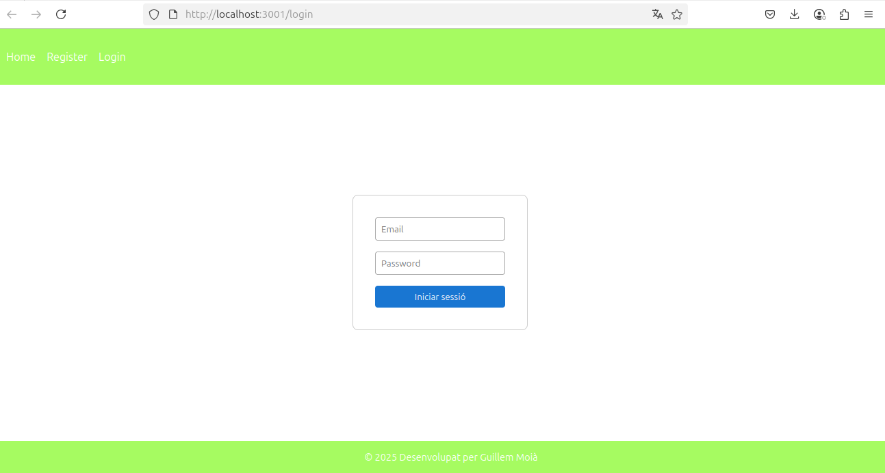

# Aplicació de Despeses per Projectes

 # El Meu Projecte

Aquest és un projecte d'aplicació que gestiona projectes compartits i despeses associades a aquests projetes entre diferents usuaris.
Els quals poden registrar-se o donar-se d'alta i després autenticar-se mitjançant Firebase.
Es podran crear projectes, afegir usuaris, que llavors es repartiran les despeses entre ells de manera transparent.
Exemple, quan un grup d'amics se'n va de copes o a un restaurant...

## Imatge d’Exemple

## Descripció

Per a cada projecte s'afegiran despeses així:
1- Concepte ( explicació)

2- Quantia ( € )

3- Pagat per ( usuari encarregat de pagar)

4- Dividir entre ( seleccionant la casella triarem els usuaris que paguen de manera mancomunada)

Podrem editar/eliminar despeses ( repartides de manera automàtica i proporcional entre els usuaris)

## Estructura bàsica
 1- React com a interfície
 
 2- React router per navegar entre pàgines
 
 3- Firebase com a backend

## Instal·lació

git clone https://github.com/guillemmoia/despesapp-curs.git

cd despesapp-curs

npm install

npm start

